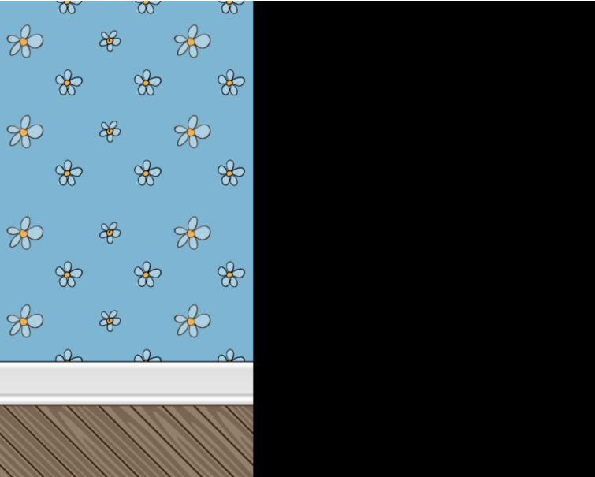

# 重复背景
首先，我们的无限奔跑者游戏需要一个永远重复的背景场景。

我们将使用[Game Art Guppy](https://www.gameartguppy.com/)的资源。

有很多不同资源可以从这个网站上免费下载。

我们将会使用[House 1 Background-Repeatable](https://www.gameartguppy.com/shop/house-1-repeatable-background/) 资源，这个资源包含激光障碍、可收集的硬币和各种装饰。

这些资源还包含睡着的狗和猫，但我们的这本书并不会使用。欢迎你找到更富有创意的方法使用他们。

## 这些静态资源放在哪？

我们的项目模板已经设置好了可以访问静态文件的文件夹，像图片之类的都可以被访问到，这个文件夹是`public`。
我们需要创建这个与`src`同级的文件夹，它长这个样子:
```
rocket-mouse-game
  o-- node_modules
  o-- public // <-- 这里
  o-- src
    o-- scenes
      -- HelloWorldScene.ts
    -- index.html
    -- main.ts
  -- .eslintignore
  -- .eslintrc.js
  -- .gitignore
  -- package.json
  -- tsconfig.json
```

接着我们在`public`里面再创建一个`house`文件夹。这个文件夹就是放背景和环境图片的地方。

`Game Art Guppy`资源包含标准图片和带`@2`后缀的高倍图。我们在这本书里面只会使用标准版本。

把`Object` 文件夹里面的资源文件复制到`house`文件夹，同时也把`Background`文件夹里的`bg_repeat_340x640.png`图片也复制到`house`里面。
你的`public`文件夹应该长这个样子：
```
rocket-mouse-game
  o-- node_modules
  o-- public
      o-- house
          -- bg_repeat_340x640.png
          -- object_bookcase1.png
          -- object_bookcase2.png
          -- object_coin.png
          -- object_laser_end.png
          -- object_laser.png
          -- object_mousehole.png
          -- object_window1.png
          -- object_window2.png
// 其它文件...
```
`public`里面的文件和文件夹被当作是`web`服务的根路径。
举个例子，你可以通过访问`http://localhost:8000/house/object_bookcase1.png`加载书柜图片。
如果图片没有加载，你可以在命令行里面用`Ctrl+c`终止进程，再次运行`npm run start`命令，重启`web`服务器。
重启之后如果图片仍然无法加载，请再次查看目录结构是否与上面的是否一致。
## 调整游戏的大小
你应该注意到我们的背景图片是640像素高，但是我们的游戏高度是600像素。让我们调整游戏的高度以匹配背景图片。
打开`main.ts` 把`config`变量里的`height`属性值从`600`改为`640`。
```ts
import Phaser from 'phaser'
import HelloWorldScene from './scenes/HelloWorldScene'

const config:Phaser.Types.Core.GameConfig = {
  type: Phaser.AUTO,
  width: 800,
  height: 640 // <- 改这里
  // 其它代码...
}

export default new Phaser.Game(config)

```
保存`main.ts` 你的浏览器窗口会自动加载更新。区分40像素的高度变化可能比较困难，但是我们可以通过右键`检查`，开发工具窗口会展示并高亮`canvas`元素，这个元素就是用来渲染游戏的。它看起来张这个样子：
```html
<canvas width="800" height="640">
```

## 创建新的游戏场景（Game Scene）

让我们在`scene`文件夹也就是`HelloWorldScene.ts`文件所在的位置创建一个新的场景叫做`Game`
新建一个文件叫做`Game.ts`，代码如下：
```ts
import Phaser from 'phaser'

export default class Game extends Phaser.Scene {
  constructor() {
    super('game')
  }

  preload() {

  }
  create() {

  }
}
```
这段代码创建了新的`Game`场景，它是`Phaser.Scene`的子类。新建场景给了一个键值`game`，这个键值是唯一的与其它场景的键值不同。

现在，我们加载重复的背景图片并展示在这个场景里。

```ts
preload () {
  this.load.image('background', 'house/bg_repeat_340x640.png')
}

create() {
  this.add.image(0, 0, 'background')
    .setOrigin(0, 0)
}
```

`preload()` 方法现在加载了`bg_repeat_340x640.png`图片，并给了它键值（key）`background`。

接下来，我们使用新建的`key`在`create()`中创建了一个图片。我们把它放在`(0, 0)`这个位置，接下来使用`setOrigin(0, 0)`将图片的原点（origin）改到图片的左上角，这个原点也就是我们熟知的枢纽点（pivot point）或锚点（anchor point）。

默认情况下，大多数`GameObjects`像图片和精灵它们的原点在`(0.5, 0.5)` 也就是这些对象的中心位置。

接下来，我们需要把`Game`场景添加到`GameConfig`中的`scene`属性中，以便在浏览器中可以看到它。

进入到`main.ts`做以下修改：
```ts
import Phaser from 'phaser'
// 我们可以删掉这行
// import HelloWorldScene from './scenes/HelloWorldScene'

// 添加这行导入Game
import Game from './scenes/Game'

const config:Phaser.Types.Core.GameConfig = {
  type: Phaser.AUTO,
  width: 800,
  height: 640,
  physics: {
    default: 'arcade',
    arcade: {
      gravity: {y: 200}
    }
  },
  // 在scene 属性中把 HelloWorldScene 替换为 Game 
  scene: [Game]
}

export default new Phaser.Game(config)

```

注意，我们在文件顶部导入了`Game`，在`scene`属性中我们把它当作`Array`添加进去。

`scene`属性可以不是`Array`类型，但因为你的游戏可能有不止一个场景，所以它经常使用数组。

我们可以删掉`HelloWorldScene.ts`这个文件了，因为我们接下来不会再用到它。

在做了这些修改后，你应该会看到下面这个样子


## 理解原点（Origin）
对于原点（origin）是怎么运作的，我们可以通过玩一玩`setOrigin(x, y)`这个函数，找找感觉。

原点指定了`(0,0)`点在图片或者精灵图的的位置。

原点值的范围是`0~1`。对于`x`和`y`两个不同的方向，`0`分别表示最左侧或者最上方，`1`分别表示最右侧或者最下方。

原点和场景坐标里的`(0, 0)`是不同的，场景里的坐标是游戏图片放置的位置。

通过调整图片或精灵的原点位置可以更好地帮助我们理解它是什么以及如何做图形变换。

例如，旋转一个图片时我们常常把原点设置为`(0.5, 0.5)`，因为大多数物体是像轮子一样是绕着中心旋转的。

原点设置成`(0, 0)`的旋转可能并不太容易想象出来。如果你想要知道这样的旋转具体什么样子，你可以设置对应的`x`和`y`值。

## 利用 `TileSprite` 重复背景
`Phaser` 有一个内建的 `TileSprite`，它可以很容易地在固定宽度内重复一张图片。

我们也可以通过首尾相连将3张图片拼接手动实现同样的效果。

但是为什么`Phaser`可以帮我们处理图片的拼接？

下面是如何制作一个`TileSprite`

```typescript
create() {
  // 存一下游戏屏幕的宽高
  const width = this.scale.width
  const height = this.scale.height

  // 将 this.add.image 改成 this.add.tileSprite
  // 注意要修改对应的传参
  this.add.tileSprite(0, 0, width, height, 'background')
    .setOrigin(0, 0)
}
```

`this.add.tileSprite`和`this.add.image` 基本上是相似的，除了`this.add.tileSprite`需要传入额外的`width`和`height`参数，以便`TileSprite`知道如何重复背景图片。

`width`和`height`值是从`Phaser`的`ScaleManager`获取的。

现在刷新你的浏览器之后可以看到重复的背景，黑边已经不见了。
接下来，我们将要添加穿喷气背包的英雄：`Rocket Mouse`。


